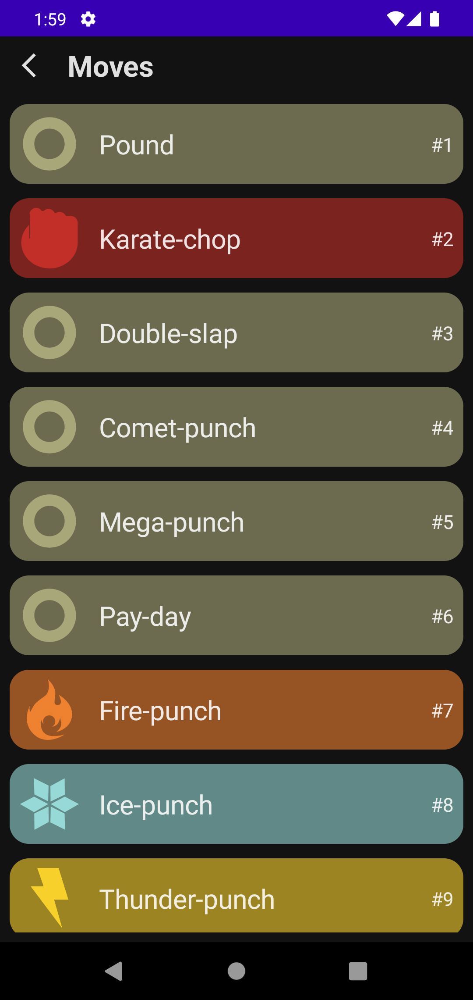
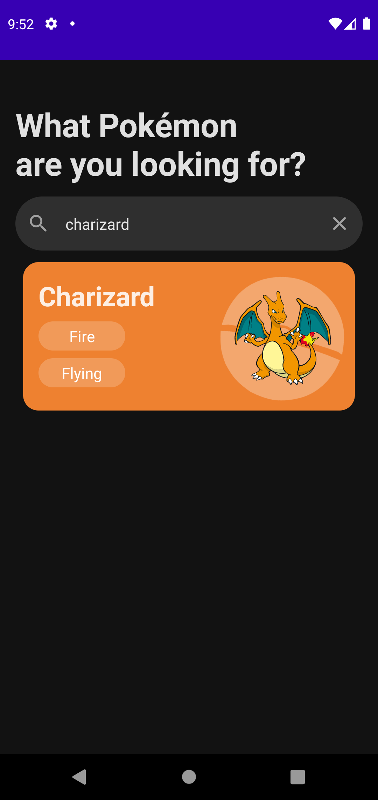
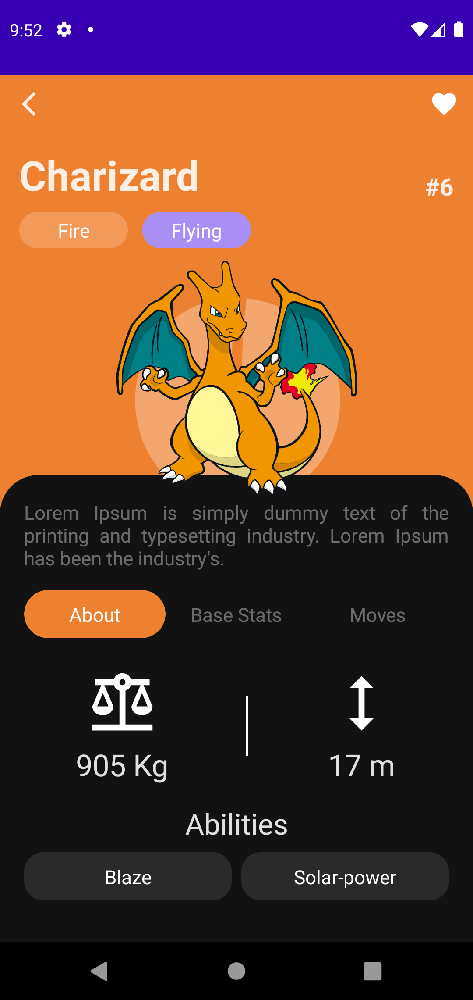

# Pokedex App

Pokedex app built with Jetpack Compose

## Screenshots

    
    
    

    
    
    

    
    
    

## Development Roadmap

- Jetpack Compose
- Room
- Retrofit
- Coil
- Hilt
- Pager - Accompanist
- Coroutines - Kotlin
- PokeApi

## Features

- [x] Light/dark mode
- [x] Home
- [x] Pokedex
- [x] Pokedex - Favorites
- [x] Pokedex - Moves
- [x] Pokedex - Types
- [x] Pokedex - Search
- [x] Pokemon Info - Favorite
- [x] Pokemon Info - About
- [x] Pokemon Info - Base Stats
- [x] Pokemon Info - Moves